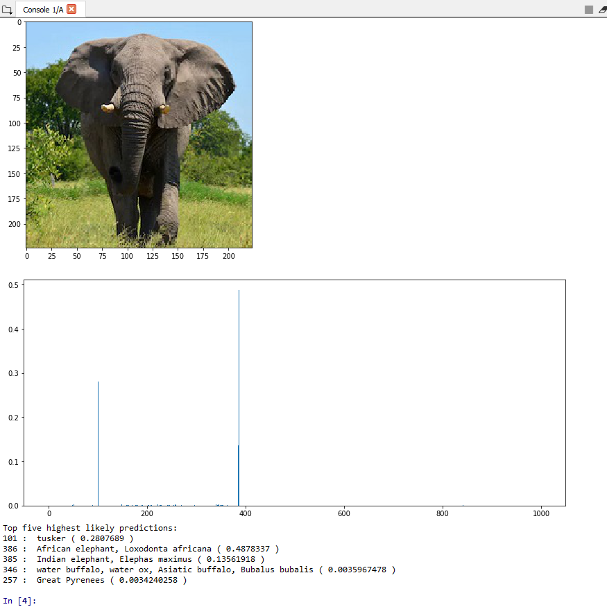

# vgg19-test
Image recognition using VGG-19

An example of building up a VGG-19 CNN and applying the pre-loaded weights manually using Keras. There are obviously easier ways to setup VGG-19 for image recognition, but I plan on using this as a reference / cookbook for more ambitious projects.

## Setup

- The pretrained model is too large to store in this repo (> 500MB), so you need to download it here and place in the repo root directory: [http://www.vlfeat.org/matconvnet/models/imagenet-vgg-verydeep-19.mat](http://www.vlfeat.org/matconvnet/models/imagenet-vgg-verydeep-19.mat)

- If you run in IPython on the Anaconda distribution, there is nothing more to setup. Otherwise, the following packages should be installed: scipy, numpy, imageio, matplotlib, keras

## Example output

Rather than giving a single prediction, we return prediction scores across all 1000 ImageNet classes, these are graphed in the bar chart.

